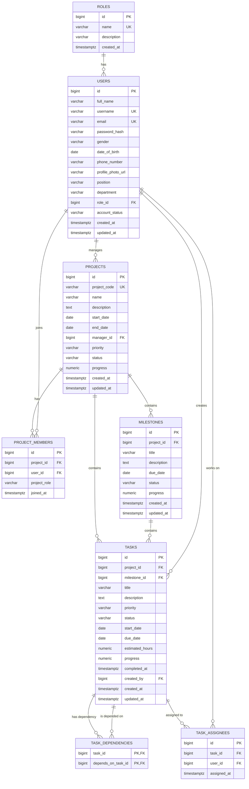

# Task & Project Management System — ERD Design

## 1. Overview

This document describes the Entity Relationship Diagram (ERD) for the Task & Project Management System.

The ERD is based on the PostgreSQL schema defined in:

```text
database/init/01-init.sql
```

The current database contains 8 core entities:

1. `roles`
2. `users`
3. `projects`
4. `project_members`
5. `milestones`
6. `tasks`
7. `task_assignees`
8. `task_dependencies`

The database supports the main workflow:

```text
Register / Login
      ↓
Create Project
      ↓
Add Team Members
      ↓
Create Milestones
      ↓
Create Tasks
      ↓
Assign Tasks
      ↓
Track Progress
```

---

# 2. ERD Diagram

The following Mermaid ERD represents the database structure and relationships.



> **Legend**
>
> * `PK` = Primary Key
> * `FK` = Foreign Key
> * `UK` = Unique Key
> * `||` = Exactly one
> * `o{` = Zero or many

---

# 3. Entity Descriptions

## 3.1 ROLES

The `roles` table defines the system-level roles available to users.

### Main roles

| Role              | Description                                         |
| ----------------- | --------------------------------------------------- |
| `ADMINISTRATOR`   | Full access to users, roles, projects, and reports  |
| `PROJECT_MANAGER` | Creates and manages projects, teams, and milestones |
| `TEAM_LEADER`     | Manages tasks and team members within a project     |
| `TEAM_MEMBER`     | Works on assigned tasks                             |

### Primary Key

```text
roles.id
```

### Relationship

One role can be assigned to many users.

```text
ROLES 1 ───────── N USERS
```

---

# 4. USERS

The `users` table stores application user accounts and profile information.

Important fields include:

* `id` — Primary key
* `username` — Unique username
* `email` — Unique email
* `password_hash` — Encrypted/hashed password
* `role_id` — Foreign key to `roles`
* `account_status` — Account state
* `created_at` — Account creation time
* `updated_at` — Last update time

### Relationship with roles

```text
ROLES
   │
   │ 1
   │
   │ N
   ▼
USERS
```

Each user must have one system role.

---

# 5. PROJECTS

The `projects` table stores project information.

Important fields include:

* `project_code`
* `name`
* `description`
* `start_date`
* `end_date`
* `manager_id`
* `priority`
* `status`
* `progress`

### Project manager

`manager_id` references:

```text
users.id
```

Therefore:

```text
USERS 1 ───────── N PROJECTS
```

One user can manage multiple projects.

---

# 6. PROJECT_MEMBERS

The `project_members` table connects users to projects.

It solves the many-to-many relationship between users and projects.

```text
USERS N ───────── N PROJECTS
            │
            │
            ▼
     PROJECT_MEMBERS
```

The table contains:

* `project_id`
* `user_id`
* `project_role`
* `joined_at`

A user can join multiple projects, and a project can contain multiple users.

The following constraint prevents the same user from being added to the same project more than once:

```text
UNIQUE(project_id, user_id)
```

---

# 7. MILESTONES

The `milestones` table stores important stages of a project.

Each milestone belongs to one project.

```text
PROJECTS 1 ───────── N MILESTONES
```

Important fields include:

* `title`
* `description`
* `due_date`
* `status`
* `progress`

Example:

```text
Project: Website Development

    ├── Milestone: UI Design
    ├── Milestone: Backend Development
    └── Milestone: Testing
```

---

# 8. TASKS

The `tasks` table stores individual pieces of work.

A task belongs to a project and can optionally belong to a milestone.

```text
PROJECTS 1 ───────── N TASKS

MILESTONES 1 ─────── N TASKS
```

Important fields include:

* `title`
* `description`
* `priority`
* `status`
* `start_date`
* `due_date`
* `estimated_hours`
* `progress`
* `completed_at`
* `created_by`

### Task status

Tasks can have the following statuses:

```text
TO_DO
IN_PROGRESS
IN_REVIEW
COMPLETED
CANCELLED
```

### Task priority

```text
LOW
MEDIUM
HIGH
URGENT
```

---

# 9. TASK_ASSIGNEES

The `task_assignees` table connects tasks and users.

It allows a task to be assigned to one or more users.

```text
USERS N ───────── N TASKS
           │
           │
           ▼
    TASK_ASSIGNEES
```

The table contains:

* `task_id`
* `user_id`
* `assigned_at`

The constraint:

```text
UNIQUE(task_id, user_id)
```

prevents the same user from being assigned to the same task more than once.

---

# 10. TASK_DEPENDENCIES

The `task_dependencies` table represents dependencies between tasks.

This is a **self-referencing relationship** because both foreign keys point to the `tasks` table.

```text
TASK A
   │
   │ depends on
   ▼
TASK B
```

For example:

```text
Task A: Design database
Task B: Implement backend
```

Task B may depend on Task A being completed first.

The table contains:

```text
task_id
depends_on_task_id
```

The database prevents a task from depending on itself:

```text
CHECK (task_id <> depends_on_task_id)
```

The business rule is:

> A task cannot start until every task it depends on is completed.

This dependency rule is enforced by application business logic rather than the database trigger.

---

# 11. Complete Relationship Summary

| #  | Relationship                   | Cardinality |
| -- | ------------------------------ | ----------- |
| 1  | `roles` → `users`              | 1 : N       |
| 2  | `users` → `projects`           | 1 : N       |
| 3  | `projects` → `project_members` | 1 : N       |
| 4  | `users` → `project_members`    | 1 : N       |
| 5  | `projects` → `milestones`      | 1 : N       |
| 6  | `projects` → `tasks`           | 1 : N       |
| 7  | `milestones` → `tasks`         | 1 : N       |
| 8  | `users` → `tasks`              | 1 : N       |
| 9  | `tasks` → `task_assignees`     | 1 : N       |
| 10 | `users` → `task_assignees`     | 1 : N       |
| 11 | `tasks` → `task_dependencies`  | 1 : N       |
| 12 | `tasks` → `task_dependencies`  | 1 : N       |

---

# 12. Overall Database Structure

The main hierarchy is:

```text
ROLES
  │
  └── USERS
       │
       ├── PROJECTS
       │     │
       │     ├── PROJECT_MEMBERS
       │     │
       │     ├── MILESTONES
       │     │      │
       │     │      └── TASKS
       │     │
       │     └── TASKS
       │
       ├── PROJECT_MEMBERS
       │
       ├── TASKS
       │
       └── TASK_ASSIGNEES

TASKS
  │
  ├── TASK_ASSIGNEES
  │
  └── TASK_DEPENDENCIES
          │
          └── TASKS
```

---

# 13. Database-to-Application Flow

The ERD supports the application's major modules.

```text
                    DATABASE
                       │
        ┌──────────────┼──────────────┐
        │              │              │
       USERS        PROJECTS         TASKS
        │              │              │
        │              │              │
   AUTH-JWT       PROJECT LOGIC   TASK BUSINESS LOGIC
        │              │              │
        └──────────────┼──────────────┘
                       │
                       ▼
                      API
                       │
              ┌────────┴────────┐
              │                 │
          TASK APIs      NOTIFICATION APIs
              │
              ▼
           FRONTEND
              │
       ┌──────┴──────┐
       │             │
    KANBAN         GANTT
```

---

# 14. Source of Truth

The PostgreSQL schema remains the source of truth for the database implementation:

```text
database/init/01-init.sql
```

The ERD in this document is a visual/documentation representation of that schema.

When the database schema changes, this ERD should also be updated.

---

# 15. Current Scope

The current ERD intentionally contains only the core tables required for:

```text
Register/Login
Create Project
Add Team Members
Create Milestones
Create Tasks
Assign Tasks
Track Progress
```

The following features are outside the current database scope and may be added in future migrations:

```text
Comments
Attachments
Notifications
Work Logs
Activity Logs
```

These should not be added to this ERD until corresponding database tables are officially added to the schema.
