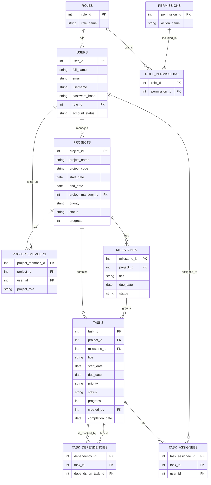
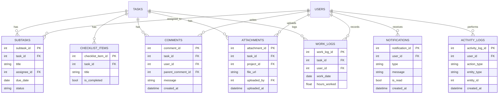

# Database ERD — Task & Project Management System

This document defines the database schema for the project. It is split into two phases:

- **Phase 1 — Core tables**: required before Backend/API development can start (per project sequencing rule: Database Design → Backend Development).
- **Phase 2 — Supporting tables**: comments, attachments, work logs, notifications, activity logs. These plug into the core tables and can be built in parallel once Phase 1 is stable.

---

## Phase 1: Core Entities

### Notes on Phase 1

- **ROLE_PERMISSIONS** is a pure junction table for the many-to-many between roles and permissions.
- **PROJECT_MEMBERS** and **TASK_ASSIGNEES** are junction tables that let a project or task have multiple people attached, each with their own role.
- **TASK_DEPENDENCIES** is self-referencing on TASKS — a task can block other tasks and be blocked by others (`task_id` = dependent task, `depends_on_task_id` = prerequisite task).

---

## Phase 2: Supporting Entities

### Notes on Phase 2

- **ATTACHMENTS** can belong to either a task or a project — both FKs should be nullable, with app-level logic enforcing that exactly one is set.
- **COMMENTS.parent_comment_id** is self-referencing, used for reply threads.
- **WORK_LOGS** rows are summed to calculate "actual time" against `TASKS.estimated_time`.
- **NOTIFICATIONS** and **ACTIVITY_LOGS** use `entity_type` + `entity_id` as a loose reference instead of a dedicated FK column per possible linked table (keeps the schema from needing a column explosion).

---

## Branch / Delivery Plan

| Order | Branch | Contents |
|---|---|---|
| 1 | `database/erd-design` | This document (Phase 1 + Phase 2 ERD) |
| 2 | `database/schema-users-roles` | USERS, ROLES, PERMISSIONS, ROLE_PERMISSIONS |
| 3 | `database/schema-projects-tasks` | PROJECTS, PROJECT_MEMBERS, MILESTONES, TASKS, TASK_ASSIGNEES, TASK_DEPENDENCIES |
| 4 | `database/schema-collab-tracking` | SUBTASKS, CHECKLIST_ITEMS, COMMENTS, ATTACHMENTS, WORK_LOGS, NOTIFICATIONS, ACTIVITY_LOGS |

Branches 2 and 3 gate Backend/API work and should be prioritized. Branch 4 can trail slightly behind but shouldn't lag too long since Frontend needs it for comments/attachments/notifications UI.
